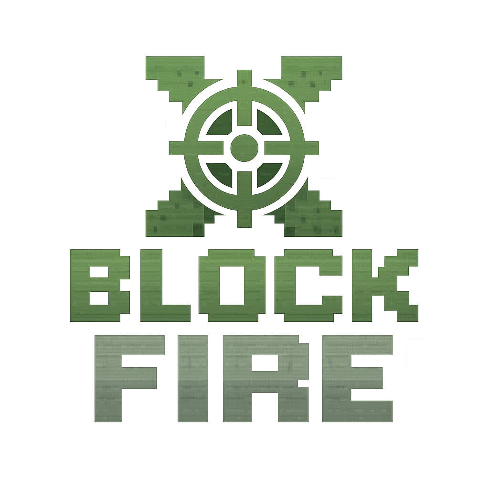

[![contributors][contributors-shield]][contributors-url]
[![forks][forks-shield]][forks-url]
[![stars][stars-shield]][stars-url]
[![issues][issues-shield]][issues-url]
[![Apache-2.0][license-shield]][license-url]


<div align='center'>
  <a href="https://github.com/xigma0512/XBlockFire">
    
  </a>
</div>

<br />
<div align="center">
<h1 align="center">XBlockFire</h1>

  <p align="center">
    一款基於 Minecraft Bedrock Edition 所打造的開源第一人稱射擊（FPS）遊戲。
    <br />
    <a href="https://github.com/xigma0512/XBlockFire/issues/new?labels=bug&template=bug-report---.md">回報錯誤</a>
    &middot;
    <a href="https://github.com/xigma0512/XBlockFire/issues/new?labels=enhancement&template=feature-request---.md">功能請求</a>
    <br />
    <a href="/.github/README.en.md">Readme English Version</a>
  </p>
</div>

---

## 簡介

**XBlockFire** 是一個開源專案，旨在將第一人稱射擊遊戲帶入 Minecraft Bedrock Edition 的世界。目前已成功實現了經典的 **BombPlant (爆破模式)**，並規劃在未來加入更多的遊戲模式。

### 專案核心特色

* **多模式遊戲框架：** 雖然目前以 **BombPlant (爆破模式)** 為核心，但專案設計時已考慮到未來擴展性，能輕鬆整合其他遊戲模式。
    * **BombPlant 模式實作：** 完整實現了攻擊方與防守方的對抗機制，包含回合制、C4 安裝與拆除、經濟系統等核心要素。
* **高度可設定性：** 專案提供了詳細的設定檔，允許使用者調整遊戲各階段的時間（如準備、購買、行動階段），以及回合獎勵、獲勝分數等遊戲參數。
* **彈性的地圖配置：** 透過 `GameMap.ts` 檔案，使用者可以輕鬆定義和新增自訂地圖，包括設定攻擊方與防守方的重生點，以及 C4 炸彈的目標安裝位置。

### 如何參與專案

**XBlockFire** 是一個開源專案，我們非常歡迎有相關能力的人一起協作。詳細內容請參考[貢獻](#貢獻)。

我們相信透過社群的力量，能讓 **XBlockFire** 成為一個更豐富且完整的遊戲。

---

## 開始使用

### 遊玩

經過測試能夠穩定運作的版本會打包成 **`.mcaddon` 檔案** 並發佈在 [Releases](https://github.com/xigma0512/XBlockFire/releases)。

本附加包已在特定 Minecraft Bedrock Edition 版本上進行測試。請確保你的遊戲版本與 [Releases](https://github.com/xigma0512/XBlockFire/releases) 中標註的推薦版本相符，以確保最佳的遊戲體驗。

### 設定

你可以透過修改設定來客製化你的世界。

* **設定 BombPlant 模式中的時間等設定**

    ```typescript
    // base/gamephase/bomb_plant/_config.ts
    export const Config = {
        idle: {
            AUTO_START: true,           // 是否在達到特定人數後開始倒數
            AUTO_START_MIN_PLAYER: 10,  // 開始倒數的特定人數
            COUNTDOWN_TIME: 30 * 20     // 倒數時間(遊戲刻=秒數*20)
        },
        buying: {
            COUNTDOWN_TIME: 20 * 20     // 購買階段的倒數時間
        },
        action: {
            ACTION_TIME: 120 * 20       // 行動階段的回合時間
        },
        C4planted: {
            COUNTDOWN_TIME: 50 * 20     // 安裝炸彈後的爆炸時間，目前不支持修改
        },
        roundEnd: {
            INCOME: [3000, 1500],       // 回合結束後的經濟分配，[(獲勝隊伍), (失敗隊伍)]
            WINNING_SCORE: 7,           // 獲勝回合數
            COUNTDOWN_TIME: 5 * 20      // 回合結束時的等待時間
        },
        gameover: {
            COUNTDOWN_TIME: 10 * 20     // 遊戲結束時的等待時間
        }
    }
    ```

    **時間單位說明：** 在所有時間設定中，單位為 **遊戲刻 (tick)**。1 秒等於 20 遊戲刻，因此若要設定 30 秒，則數值為 `30 * 20`。目前 `C4planted` 階段的倒數時間暫不支持修改，這是為了確保遊戲平衡性或技術上的限制。未來版本可能會考慮開放此項設定。

* **設定 GameMap 來自訂你的地圖**

    ```typescript
    // base/gamemap/GameMap.ts
    export default {
        0: {
            // 地圖ID
            id: 0,
            // 地圖名稱
            name: 'Melon Map',
            // 地圖簡介
            description: 'A Good Map',
            // 遊戲中會使用到的座標
            positions: {
                // 攻擊方重生點，會從上到下依序分配位置
                attacker_spawns: [
                    { x: 208, y: 93, z: 480 },
                    { x: 208, y: 93, z: 478 },
                    { x: 208, y: 93, z: 476 },
                    { x: 206, y: 93, z: 479 },
                    { x: 206, y: 93, z: 477 }
                ],
                // 防守方重生點，會從上到下依序分配位置
                defender_spawns: [
                    { x: 256, y: 93, z: 436 },
                    { x: 256, y: 93, z: 438 },
                    { x: 256, y: 93, z: 440 },
                    { x: 258, y: 93, z: 437 },
                    { x: 258, y: 93, z: 439 }
                ],
                // 炸彈目標點，C4只能夠被安裝在這些位置的周圍4.5格範圍內
                C4_targets: [
                    { x: 228, y: 93, z: 440 },
                    { x: 253, y: 93, z: 463 }
                ]
            }
        }
    } as Record<number, GameMapType>;
    ```

    **獲取遊戲內座標：** 你可以在遊戲中使用 `/tp ~ ~ ~` 或開啟座標顯示（設定 -> 遊戲 -> 顯示座標）來獲取當前位置的精確 X、Y、Z 座標，以便於設定重生點和 **C4 目標點**。

    **C4 目標點與安裝範圍：** `C4_targets` 定義了 C4 炸彈可以被安裝的目標點。玩家必須位於這些目標點周圍 **4.5 格半徑範圍內** 才能成功安裝 C4。這意味著炸彈可以在目標點中心周圍的較大區域內放置，提供一定的靈活性。

    **新增自訂地圖：** 若要新增更多自訂地圖，只需在 `GameMap.ts` 檔案中，依照現有地圖 `0` 的格式，新增一個新的地圖 ID 和其對應的設定即可。確保每個地圖 ID 都是獨一無二的。

---

## 授權

本專案採用 Apache-2.0 授權條款。更多資訊請參閱 [LICENSE](https://github.com/xigma0512/XBlockFire/blob/master/LICENSE)。

---

## 貢獻

我們高度歡迎並感謝任何形式的貢獻！您的幫助對此專案至關重要。

### 如何貢獻？

* **回報問題或建議功能 (Issues & Feature Requests)**：如果您發現任何錯誤、有疑問或對專案有新功能建議，請隨時在我們的 [Issue](https://github.com/xigma0512/XBlockFire/issues/new) 頁面開啟一個議題。

* **提供技術支援**：
    * 動畫：包括換彈、射擊、切換武器等。
    * 模型：高品質的 3D 槍械模型。
    * 音效：射擊、換彈、槍機復位/滑套鎖定等音效。
    * 其他：任何其他技術協助。

* **直接貢獻程式碼或功能**：
    * 複製專案 (Fork the Project)
    * 建立您的功能分支 (git checkout -b feature/AmazingFeature)
    * 提交您的變更 (git commit -m 'Add some AmazingFeature')
    * 推送到分支 (git push origin feature/AmazingFeature)
    * 開啟一個拉取請求 (Pull Request)

如果您能提供相關資源，或知道哪裡可以找到高品質的免費/開源資源，請[聯繫我們](#聯繫)。

### 主要貢獻者

<a href="https://github.com/xigma0512/XBlockFire/graphs/contributors">
  
</a>

---

## 聯繫

**Discord**: @xigma0512

**Discord 社群**: https://discord.gg/mUwJukn23N

**專案連結**: https://github.com/xigma0512/XBlockFire

---

## 致謝

* [腳本 API 參考文檔 (Script API Reference Documentation)](https://learn.microsoft.com/en-us/minecraft/creator/scriptapi/?view=minecraft-bedrock-experimental)
* [基岩版範例 (bedrock-samples)](https://github.com/Mojang/bedrock-samples)
* [基岩版維基 (Bedrock Wiki)](https://wiki.bedrock.dev/)

[contributors-shield]: https://img.shields.io/github/contributors/xigma0512/XBlockFire.svg?style=for-the-badge
[contributors-url]: https://github.com/xigma0512/XBlockFire/graphs/contributors

[forks-shield]: https://img.shields.io/github/forks/xigma0512/XBlockFire.svg?style=for-the-badge
[forks-url]: https://github.com/xigma0512/XBlockFire/network/members

[stars-shield]: https://img.shields.io/github/stars/xigma0512/XBlockFire.svg?style=for-the-badge
[stars-url]: https://github.com/xigma0512/XBlockFire/stargazers

[issues-shield]: https://img.shields.io/github/issues/xigma0512/XBlockFire.svg?style=for-the-badge
[issues-url]: https://github.com/xigma0512/XBlockFire/issues

[license-shield]: https://img.shields.io/github/license/xigma0512/XBlockFire.svg?style=for-the-badge
[license-url]: https://github.com/xigma0512/XBlockFire/blob/master/LICENSE.txt