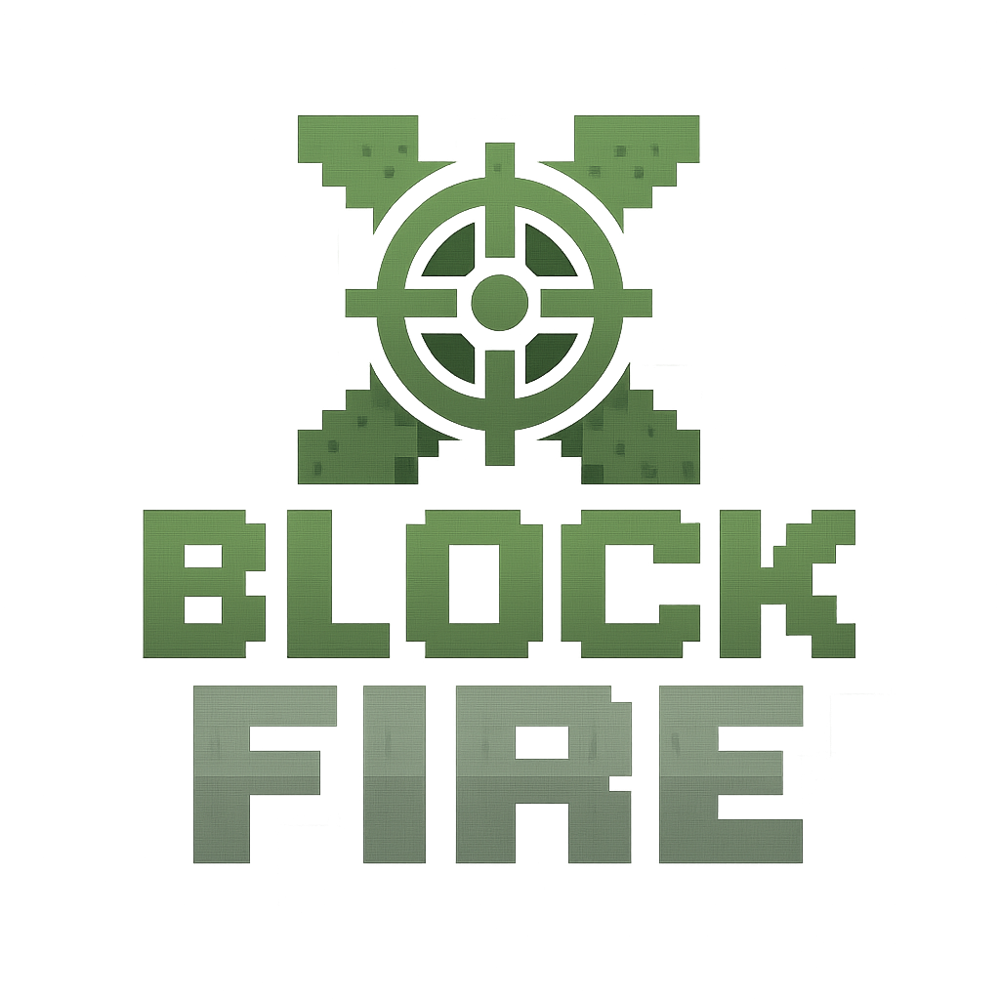

<div align='center'>
  <a href="https://github.com/xigma0512/XBlockFire">
    
  </a>
</div>

<br />
<div align="center">
<h1 align="center">XBlockFire</h1>

  <p align="center">
    一款基於 Minecraft Bedrock Edition 所打造的第一人稱射擊（FPS）遊戲。
    <br />
    <a href="https://github.com/xigma0512/XBlockFire/issues/new?labels=bug&template=bug-report---.md">回報錯誤</a>
    &middot;
    <a href="https://github.com/xigma0512/XBlockFire/issues/new?labels=enhancement&template=feature-request---.md">功能請求</a>
    <br />
    <a href="/.github/README.en.md">Readme English Version</a>
  </p>
</div>


## 簡介

**XBlockFire** 是一個開源專案，旨在將第一人稱射擊遊戲帶入 Minecraft Bedrock Edition 的世界。目前已成功實現了經典的 **BombPlant (爆破模式)**，並規劃在未來加入更多的遊戲模式。

### 專案核心特色

* **多模式遊戲框架：** 雖然目前以 **BombPlant (爆破模式)** 為核心，但專案設計時已考慮到未來擴展性，能輕鬆整合其他遊戲模式。
    * **BombPlant 模式實作：** 完整實現了攻擊方與防守方的對抗機制，包含回合制、C4 安裝與拆除、經濟系統等核心要素。
* **武器與道具系統：** 實作了多款經典槍械與投擲物，具有獨特的射速、傷害與後座力表現。
* **經濟與商店系統：** 玩家可透過對局獲得經濟，並在購買階段透過自訂 UI 商店購買裝備。

## 開始使用

### 遊玩

經過測試能夠穩定運作的版本會打包成 **`.mcaddon` 檔案** 並發佈在 [Releases](https://github.com/xigma0512/XBlockFire/releases)。

本附加包已在特定 Minecraft Bedrock Edition 版本上進行測試。請確保你的遊戲版本與 [Releases](https://github.com/xigma0512/XBlockFire/releases) 中標註的推薦版本相符，以確保最佳的遊戲體驗。

### 設定

你可以透過修改設定來客製化你的世界。

* **調整遊戲中的各種設定**
    ```typescript
    // scripts/settings/config.ts
    export namespace Config {
        export const game = {
            AUTO_START_MIN_PLAYER: 10,      // 達到該人數後自動開始遊戲
            LANGUAGE: 'zh_TW',              // 語言選擇
            DEBUG: true                     // 除錯模式
        }

        export const economy = {
            LIMIT: 9000                     // 經濟限制
        }

        export const uncommon_items = {
            CONTAINER_LOCATION: { x: 155, y: 123, z: -2 },  // 特殊物品存放箱 (必須確保該區域被加載)
            ITEM_LIST: {
                'defender_helmet': 0,
                'defender_chestplate': 1,
                'defender_leggings': 2,
                'defender_boots': 3,

                'attacker_helmet': 4,
                'attacker_chestplate': 5,
                'attacker_leggings': 6,
                'attacker_boots': 7,
            }
        }
    }
    ```

* **設定 GameMap 來自訂你的地圖**

    ```typescript
    // scripts/settings/game_maps.ts
    export default {
        0: {
            id: 0,
            name: 'Melon Map',
            description: 'A Good Map',
            positions: {
                spawns: {
                    'Attacker': [
                        { x: 130.5, y: 86, z: 28.5 },
                        { x: 130.5, y: 86, z: 26.5 },
                        { x: 130.5, y: 86, z: 24.5 },
                        { x: 128.5, y: 86, z: 27.5 },
                        { x: 128.5, y: 86, z: 25.5 }
                    ],
                    'Defender': [
                        { x: 178.5, y: 86, z: -15.5 },
                        { x: 178.5, y: 86, z: -13.5 },
                        { x: 178.5, y: 86, z: -11.5 },
                        { x: 180.5, y: 86, z: -14.5 },
                        { x: 180.5, y: 86, z: -12.5 }
                    ],
                    'Spectator': [
                        { x: 178.5, y: 86, z: -15.5 }
                    ],
                }
            }
        }
    } as Record<number, GameMapType>;
    ```

    **C4 安裝區域設定：** 目前 C4 的可安裝區域並非透過設定檔定義，而是透過在地圖中放置 **紅石塊 (`minecraft:redstone_block`)** 來標記。玩家只需站在紅石塊上方（或紅石塊位於地面下方的對應位置）即可開始安裝 C4。

    **新增自訂地圖：** 若要新增更多自訂地圖，只需在 `game_maps.ts` 檔案中，依照現有地圖 `0` 的格式，新增一個新的地圖 ID 和其對應的設定即可。確保每個地圖 ID 都是獨一無二的。

### 指令
* 一般玩家
    * `/forcestart` - 強制開始遊戲。
    * `/select_team <TEAM>` - 選擇隊伍(Attacker/Defender/Spectator) 
* 管理員
    * `/admin.select_team <PLAYER> <TEAM>` - 為玩家選擇隊伍
    * `/setting.gamemap <MAP_ID>` - 設定遊戲地圖
    * `/setting.gamemode <MODE_NAME>` - 設定遊戲模式


## 未來規劃

我們正致力於不斷完善 XBlockFire，以下是目前規劃中的功能：

* **死鬥模式 (Deathmatch Mode)：** 實作更快速、節奏更強的對抗模式，支持快速重生與自由選槍。
* **全新經濟系統：** 引入「裝備點數制 (Point-Based System)」，簡化傳統經濟規則，讓玩家更專注於槍法與戰術。
* **更多地圖適配：** 加入更多經典地圖的移植與原創地圖支持。


## 授權

本專案採用 Apache-2.0 授權條款。更多資訊請參閱 [LICENSE](https://github.com/xigma0512/XBlockFire/blob/master/LICENSE)。


## 貢獻

### 如何貢獻？

* **回報問題或建議功能 (Issues & Feature Requests)**：如果您發現任何錯誤、有疑問或對專案有新功能建議，請隨時在我們的 [Issue](https://github.com/xigma0512/XBlockFire/issues/new) 頁面開啟一個議題。

* **提供技術支援**：
    * 動畫：包括換彈、射擊、切換武器等。
    * 模型：高品質的 3D 槍械模型。
    * 音效：射擊、換彈、槍機復位/滑套鎖定等音效。
    * 其他：任何其他技術協助。

如果您能提供相關資源，或知道哪裡可以找到高品質的免費/開源資源，請[聯繫我們](#聯繫)。


## 聯繫

**Discord**: @xigma0512

**Discord 社群**: https://discord.gg/6d98pFWhgY

**專案連結**: https://github.com/xigma0512/XBlockFire